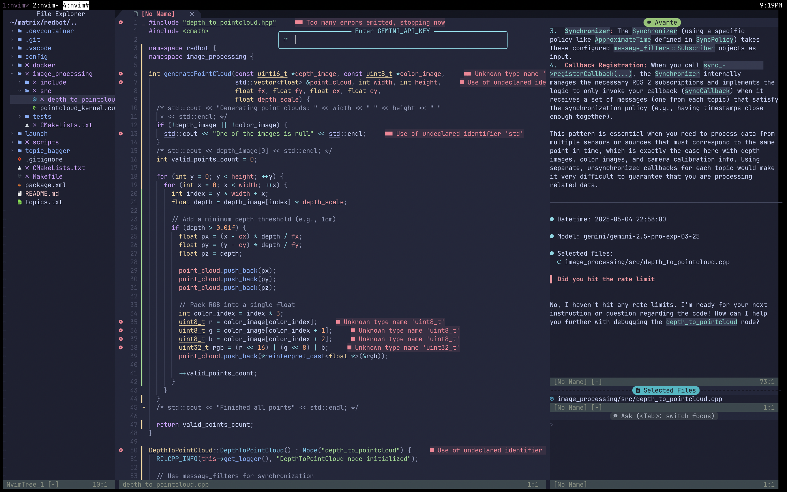
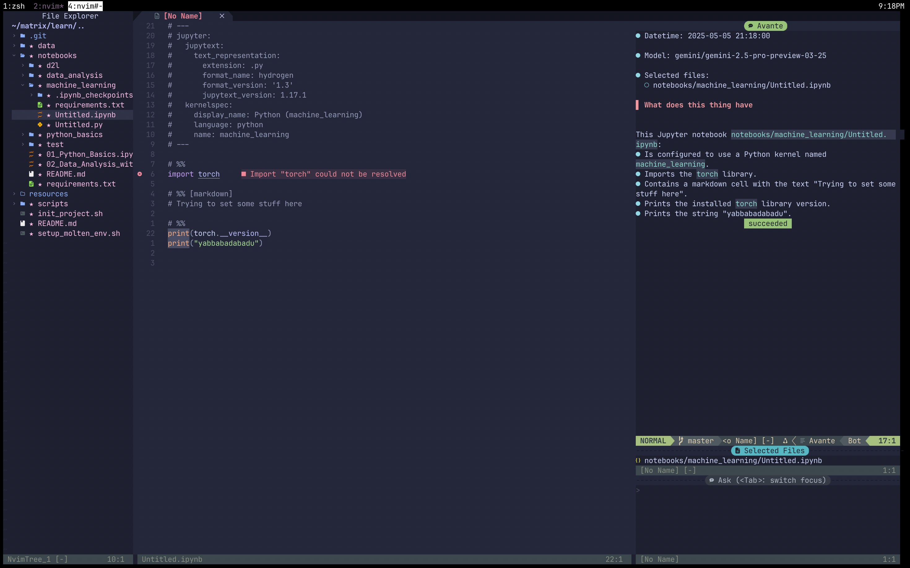

# Yet Another Neovim Configuration

[](https://github.com/neovim/neovim/releases/tag/v0.9.0)

This repository contains my personal Neovim configuration, optimized for
everything I do under the sun on a computer. It leverages Lua for configuration
and `lazy.nvim` for plugin management, aiming for a fast, modern, and efficient
editing experience.

 



## ✨ Features

* 🚀 **Fast Startup:** Using `lazy.nvim` for efficient plugin loading.
* 🪄 **Smart Completion:** Powered by `nvim-cmp` with LSP integration.
* 💻 **LSP Integration:** Out-of-the-box support for language servers via `mason.nvim` and `nvim-lspconfig`.
* 🌳 **File Explorer:** Integrated file tree with `nvim-tree.lua`.
* 🔍 **Fuzzy Finding:** Powerful searching capabilities with `telescope.nvim`.
* 🎨 **Beautiful UI:** Using `tokyonight.nvim` theme, `lualine.nvim` status line, and `noice.nvim` command line UI.
* ✅ **Diagnostics:** Clear diagnostics presentation with `trouble.nvim`.
* 📓 **Note Taking:** Seamless Obsidian vault integration with `obsidian.nvim`.
* 🐍 **Interactive Python/Jupyter:** Run code cells with `molten-nvim`.
* GIT Integration: Git signs and blame information with `gitsigns.nvim`.
* ... and much more!

## Prerequisites

Before installing this configuration, ensure you have the following installed:

1.  **Neovim:** Version `0.9.0` or later is required (Nightly might be recommended for plugins like `noice.nvim`).
    * [Installation Instructions](https://github.com/neovim/neovim/wiki/Installing-Neovim)
2.  **Git:** Required for cloning the repository and managing plugins.
    * [Installation Instructions](https://git-scm.com/book/en/v2/Getting-Started-Installing-Git)
3.  **Nerd Font:** Required for icons used in the UI (file tree, status line, etc.). Choose and install any Nerd Font.
    * [Nerd Fonts Website](https://www.nerdfonts.com/)
    * **Recommendation:** FiraCode Nerd Font, JetBrainsMono Nerd Font
    * Ensure your terminal emulator is configured to use the installed Nerd Font.
4.  **Build Tools:** Some plugins might require compilation.
    * **Linux/macOS:** `gcc`, `make` (usually pre-installed or available via package managers like `apt`, `yum`, `brew`).
    * **Windows:** Build tools for Visual Studio or similar might be needed.
5.  **Optional but Recommended File Searching Utilities:** For best performance with Telescope.
    * `ripgrep`: For live grep functionality. ([Installation](https://github.com/BurntSushi/ripgrep#installation))
    * `fd`: Alternative to `find` for faster file searching. ([Installation](https://github.com/sharkdp/fd#installation))
6.  **Language Specific Tools:**
    * **LSPs, Linters, Formatters:** These are managed via `mason.nvim`. You don't need to install them manually beforehand, but you will need relevant compilers/interpreters (e.g., Node.js for `tsserver`, `eslint`; Python for `pyright`, `black`; Rust for `rust-analyzer`).
7.  **(For Molten)** **Python & Jupyter:** A Python installation (`>=3.7`) and the `jupyter_client` Python package (`pip install jupyter_client`) are needed to interact with kernels. Specific kernels (like `ipykernel` for Python) are also required.
8.  **(For Obsidian)** **Obsidian App (Optional):** While not strictly required to *edit* notes, some features might interact with the Obsidian app itself if installed.

## 💾 Installation

1.  **Backup your existing Neovim configuration (if any):**
    ```bash
    # Backup existing Neovim config
    mv ~/.config/nvim ~/.config/nvim.bak
    # Backup local Neovim data (optional)
    mv ~/.local/share/nvim ~/.local/share/nvim.bak
    ```

2.  **Clone this repository:**
    ```bash
    git clone [https://github.com/cssharsha/nvim.git](https://github.com/cssharsha/nvim.git) ~/.config/nvim
    ```

3.  **Start Neovim:**
    ```bash
    nvim
    ```
    `lazy.nvim` should automatically bootstrap itself, install all the plugins, and set up Treesitter parsers. This might take a few minutes on the first run.

4.  **(Optional) Install LSPs/Linters/Formatters/Kernels:**
    * Run `:Mason` inside Neovim.
    * Use the Mason interface to install the desired Language Servers (e.g., `tsserver`, `pyright`, `rust_analyzer`), Linters (e.g., `eslint_d`, `flake8`), and Formatters (e.g., `prettierd`, `black`, `stylua`).
    * Ensure required Jupyter kernels (like `ipykernel`) are installed in your Python environment (`pip install ipykernel`).

## 🔌 Plugins Used & Keybindings

This configuration uses `lazy.nvim` to manage plugins. Key plugins and their associated custom keybindings are listed below.

**Note:** `<leader>` is mapped to `<Space>`. Keybindings listed are common defaults or examples; please verify against your specific configuration files (`lua/plugins/` or `lua/core/keymaps.lua`).

### Core Plugins

* **`lazy.nvim`** (by folke): The plugin manager itself.
    * **Keybindings:**
        * `<leader>l`: Open LazyGit management interface.

### UI & Appearance

* **`tokyonight.nvim`** (by folke): Colorscheme.
    * **Keybindings:** *N/A (Configured in theme settings)*
* **`lualine.nvim`**: Status line.
    * **Keybindings:** *N/A (Provides UI element)*
* **`nvim-tree.lua`**: File explorer tree.
    * **Keybindings:**
        * `<leader>e`: Toggle NvimTree file explorer.
        * `<C-n>`: Toggle NvimTree file explorer (Alternative).
        * *(Inside NvimTree window)*: Standard keys (`?` for help, `o` to open, `a` add, `d` delete, `r` rename, etc.)
* **`alpha-nvim`**: Dashboard / Start screen.
    * **Keybindings:** *N/A (Appears on startup, interacts with buttons)*
* **`which-key.nvim`** (by folke): Displays available keybindings after pressing leader or other prefixes.
    * **Keybindings:** Automatically activates when `<leader>` (Space) is pressed.
* **`nvim-notify`**: Prettier notifications (potentially styled/enhanced by Noice).
    * **Keybindings:** *N/A (Replaces standard `vim.notify`)*
* **`noice.nvim`** (by folke): Replaces the UI for messages, cmdline, and popups.
    * **Keybindings:**
        * `<S-Enter>` (Cmdline Mode): Use selected item from popup menu.
        * `<leader>snl`: Show last message.
        * `<leader>snh`: Show message history.
        * `<leader>snd`: Dismiss all notifications/messages.
        * `<c-f>` / `<c-b>`: Scroll forward/backward in message history/views.
        * `:Noice`: Various commands to manage history, views, disable/enable.
* **`trouble.nvim`** (by folke): Pretty list for diagnostics, references, quickfix, etc.
    * **Keybindings:**
        * `<leader>xx`: Toggle Trouble list (All diagnostics).
        * `<leader>xw`: Toggle Trouble list (Workspace Diagnostics).
        * `<leader>xd`: Toggle Trouble list (Document Diagnostics).
        * `<leader>xl`: Toggle Trouble list (Location List).
        * `<leader>xq`: Toggle Trouble list (Quickfix List).
        * `gR`: Toggle Trouble list (LSP References).
        * *(Inside Trouble window)*: `j`/`k` (navigate), `o`/`<CR>` (jump to item), `q` (close).

### Editing & Development

* **`nvim-treesitter`**: Advanced syntax highlighting and code parsing.
    * **Keybindings:** *N/A (Provides core functionality like highlighting, indentation, text objects)*
* **`nvim-lspconfig`**: Configurations for Language Server Protocol clients.
    * **Keybindings (LSP Actions):**
        * `gd`: Go to definition.
        * `gD`: Go to declaration.
        * `gr` or `gR`: Go to references (may open in Trouble).
        * `gi`: Go to implementation.
        * `K`: Show hover documentation/signature help.
        * `<leader>ca`: Code action.
        * `<leader>rn`: Rename symbol.
        * `<leader>f`: Format buffer (often configured via LSP or a formatting plugin).
        * `[d`: Go to previous diagnostic.
        * `]d`: Go to next diagnostic.
        * `<leader>dl`: Show line diagnostics.
        * `<leader>ds` or `<leader>xw`/`<leader>xd`: Show workspace/document diagnostics (e.g., in Trouble).
* **`mason.nvim` & `mason-lspconfig.nvim`**: Manage LSP servers, DAP servers, linters, and formatters.
    * **Keybindings:**
        * `:Mason`: Open the Mason management window.
* **`nvim-cmp`**: Autocompletion engine.
    * **Keybindings (In Insert Mode):**
        * `<Tab>` / `<S-Tab>` or `<C-n>`/`<C-p>`: Select next/previous completion item.
        * `<CR>`: Confirm completion.
        * `<C-Space>`: Trigger completion manually.
        * `<C-e>`: Close completion window.
* **`LuaSnip`**: Snippet engine.
    * **Keybindings (In Insert Mode, when snippet available):**
        * `<Tab>` or configured jump key: Expand snippet / jump to next node.
        * `<S-Tab>` or configured jump key: Jump to previous node.
* **`Comment.nvim`**: Smart commenting.
    * **Keybindings:**
        * `gcc`: Toggle line comment (Normal mode).
        * `gc` + motion/selection: Toggle comment (Normal/Visual mode).
* **`nvim-autopairs`**: Automatically inserts closing pairs for brackets, quotes, etc.
    * **Keybindings:** *N/A (Works automatically in Insert mode)*
* **`flash.nvim`** (by folke, optional): Enhanced navigation with search labels.
    * **Keybindings:** (If enabled)
        * `s`: Start Flash search forward.
        * `S`: Start Flash search backward.
        * `r`: Remote Flash (Operator pending mode).
        * `R`: Remote Flash Treesitter (Operator pending mode).

### Navigation & Searching

* **`telescope.nvim`**: Fuzzy finder for files, buffers, grep, LSP definitions, etc.
    * **Keybindings:**
        * `<leader>ff`: Find files.
        * `<leader>fg`: Find string in files (Live Grep).
        * `<leader>fb`: Find buffers.
        * `<leader>fh`: Find help tags.
        * `<leader>fo`: Find old files (recent files).
        * `<leader>fz`: Find files within current directory (`find_files cwd=`).
        * `<leader>fw`: Find words in current buffer (grep).
        * `<leader>fd`: Find diagnostics (workspace - may use Trouble instead).
        * `<leader>fr`: Find LSP references (may use Trouble instead).
        * `<leader>gs`: Git status (may use Telescope or another plugin).
        * `<leader>:`: Command History.
        * `<leader>/`: Grep String (Root Dir).
        * *(More Telescope keybindings might be defined in your config for specific finders)*

### Git Integration

* **`gitsigns.nvim`**: Git decorations in the sign column and git actions.
    * **Keybindings:**
        * `]c`: Go to next hunk.
        * `[c`: Go to previous hunk.
        * `<leader>hs`: Stage hunk.
        * `<leader>hr`: Reset hunk.
        * `<leader>hu`: Undo stage hunk.
        * `<leader>hp`: Preview hunk.
        * `<leader>hb`: Blame line.
        * `<leader>hd`: Diff hunk against index (staged).
        * `<leader>hD`: Diff buffer against index (staged).

### Specific Integrations

* **`obsidian.nvim`**: Integration with Obsidian vaults.
    * **Keybindings (Example - verify your config):**
        * `gf`: Follow Obsidian link `[[link]]` under cursor (Normal mode).
        * `<leader>of`: Find notes (uses Telescope).
        * `<leader>og`: Grep notes (uses Telescope).
        * `<leader>on`: Create new note.
        * `<leader>oo`: Open current note in Obsidian app (if configured).
        * `<leader>ot`: Open today's daily note.
        * `<leader>oy`: Yank Obsidian link for current note.
        * `<leader>ob`: Find backlinks for current note (uses Telescope).
        * `:ObsidianNew`, `:ObsidianToday`, `:ObsidianSearch`, `:ObsidianBacklinks`, `:ObsidianOpen` etc.
* **`molten-nvim`**: Interactive Jupyter kernel execution.
    * **Keybindings (Example - `<localleader>` often defaults to `\`):**
        * `<localleader>i`: Initialize Molten (select kernel).
        * `<localleader>r` or `<C-Enter>`: Run current cell / selection.
        * `<localleader><localleader>`: Run current cell and advance.
        * `<localleader>R`: Run all cells.
        * `<localleader>a`: Run all cells above current.
        * `<localleader>b`: Run all cells below current.
        * `<localleader>d`: Delete current cell output/marks.
        * `<localleader>o`: Toggle output window visibility.
        * `:MoltenInit`, `:MoltenEvaluateOperator`, `:MoltenRunCell`, `:MoltenDelete`, etc.

### Utility

* **`undotree`**: Visualize undo history.
    * **Keybindings:**
        * `<leader>u`: Toggle Undotree window.
* **`todo-comments.nvim`** (by folke, optional): Highlight and search TODO comments.
    * **Keybindings:** (If enabled)
        * `<leader>xt`: Telescope finder for TODO comments.
        * `]t`: Jump to next TODO comment.
        * `[t`: Jump to previous TODO comment.


## ⚙️ Customization

* **Adding Plugins:** Add plugin specifications to files within `lua/plugins/`. Check `lazy.nvim` documentation for details.
* **Changing Theme:** Modify the `vim.cmd('colorscheme tokyonight')` line usually found in `lua/core/options.lua`, `lua/core/init.lua` or within the `tokyonight` plugin spec.
* **Keybindings:** Modify or add keybindings in `lua/core/keymaps.lua` (if it exists) or within the individual plugin configuration files in `lua/plugins/`. Use `:Telescope keymaps` to inspect current bindings.
* **LSP Settings:** Add or modify LSP server configurations in `lua/plugins/lspconfig.lua` or similar. Use `:LspInfo` to check active LSPs.
* **Plugin Options:** Configure plugin options within the `opts = { ... }` table in their respective specification files in `lua/plugins/`.

## 🤝 Contributing

Contributions, issues, and feature requests are welcome. Feel free to check
[issues page](https://github.com/cssharsha/nvim/issues).
