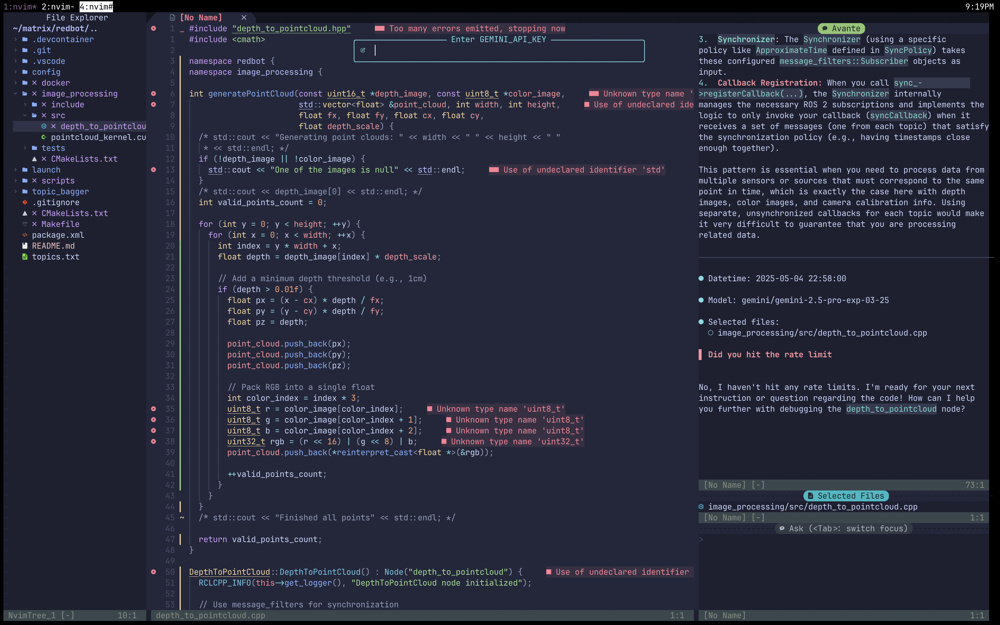
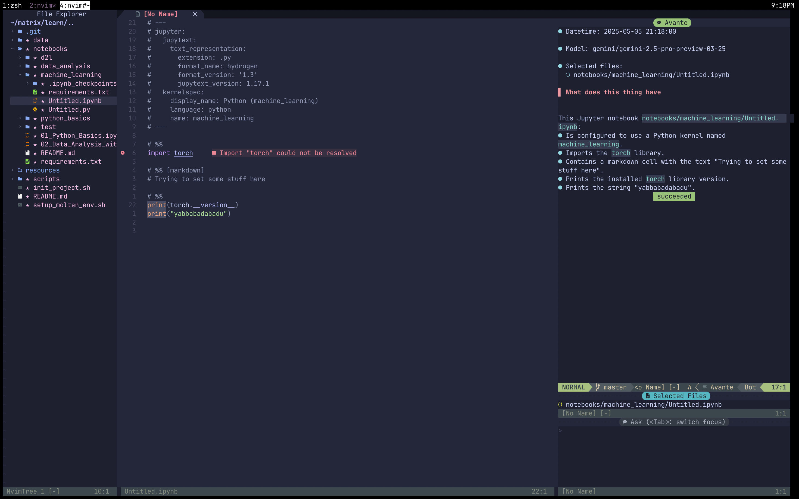

# Yet Another Neovim Configuration

[](https://github.com/neovim/neovim/releases/tag/v0.9.0)

This repository contains my personal Neovim configuration, optimized for
everything I do under the sun on a computer. Uses `lazy.nvim` for package management.

 



## ✨ Features

* 🚀 Uses `blink.cmp` for LSP completion. Some of the notable providers:
    * `blink.emoji` - Obviously
    * `blink-cmp-avante` - For the cutocomplete in the avante chat. Note that it is not really successful in
        adding som `kind` and `icon` stuff
* 🤖Added two different llm helpers:
    * `avante`: For chat interface. Works exceptionally well that I have forgotten all about cursor which made me
    move away from vim.
    * `supermaven`: For code autocomplete.
* 🖌️Added `themery` with a twist for handling themes. Ive just added a bunch of them obviously. Settled upon `melange`
* 🧰All the defacto tools like `telescope`, `treesitter` added. `treefileexplorer` for file explorer.

## Prerequisites

Before installing this configuration, ensure you have the following installed:

1.  **Neovim:** Version `0.9.0` or later is required (Nightly might be recommended for plugins like `noice.nvim`).
    * [Installation Instructions](https://github.com/neovim/neovim/wiki/Installing-Neovim)
2.  **Git:** Required for cloning the repository and managing plugins.
    * [Installation Instructions](https://git-scm.com/book/en/v2/Getting-Started-Installing-Git)
3.  **Nerd Font:** Required for icons used in the UI (file tree, status line, etc.). Choose and install any Nerd Font.
    * [Nerd Fonts Website](https://www.nerdfonts.com/)
    * **Recommendation:** FiraCode Nerd Font, JetBrainsMono Nerd Font
    * Ensure your terminal emulator is configured to use the installed Nerd Font.
4.  **Build Tools:** Some plugins might require compilation.
    * **Linux/macOS:** `gcc`, `make` (usually pre-installed or available via package managers like `apt`, `yum`, `brew`).
    * **Windows:** Build tools for Visual Studio or similar might be needed.
5.  **Optional but Recommended File Searching Utilities:** For best performance with Telescope.
    * `ripgrep`: For live grep functionality. ([Installation](https://github.com/BurntSushi/ripgrep#installation))
    * `fd`: Alternative to `find` for faster file searching. ([Installation](https://github.com/sharkdp/fd#installation))
6.  **Language Specific Tools:**
    * **LSPs, Linters, Formatters:** These are managed via `mason.nvim`. You don't need to install them manually beforehand, but you will need relevant compilers/interpreters (e.g., Node.js for `tsserver`, `eslint`; Python for `pyright`, `black`; Rust for `rust-analyzer`).
7.  **(For Molten)** **Python & Jupyter:** A Python installation (`>=3.7`) and the `jupyter_client` Python package (`pip install jupyter_client`) are needed to interact with kernels. Specific kernels (like `ipykernel` for Python) are also required.
8.  **(For Obsidian)** **Obsidian App (Optional):** While not strictly required to *edit* notes, some features might interact with the Obsidian app itself if installed.

## 💾 Installation

1.  **Backup your existing Neovim configuration (if any):**
    ```bash
    # Backup existing Neovim config
    mv ~/.config/nvim ~/.config/nvim.bak
    # Backup local Neovim data (optional)
    mv ~/.local/share/nvim ~/.local/share/nvim.bak
    ```

2.  **Clone this repository:**
    ```bash
    git clone [https://github.com/cssharsha/nvim.git](https://github.com/cssharsha/nvim.git) ~/.config/nvim
    ```

3.  **Start Neovim:**
    ```bash
    nvim
    ```
    `lazy.nvim` should automatically bootstrap itself, install all the plugins, and set up Treesitter parsers. This might take a few minutes on the first run.

4.  **(Optional) Install LSPs/Linters/Formatters/Kernels:**
    * Run `:Mason` inside Neovim.
    * Use the Mason interface to install the desired Language Servers (e.g., `tsserver`, `pyright`, `rust_analyzer`), Linters (e.g., `eslint_d`, `flake8`), and Formatters (e.g., `prettierd`, `black`, `stylua`).
    * Ensure required Jupyter kernels (like `ipykernel`) are installed in your Python environment (`pip install ipykernel`).

## 🔌 Keybindings

`which-key` available so should be easy to explore.
